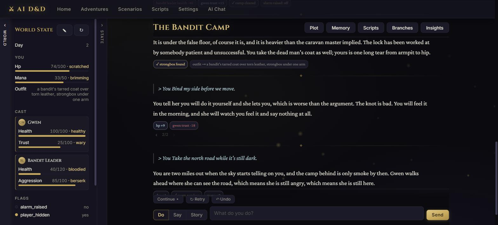
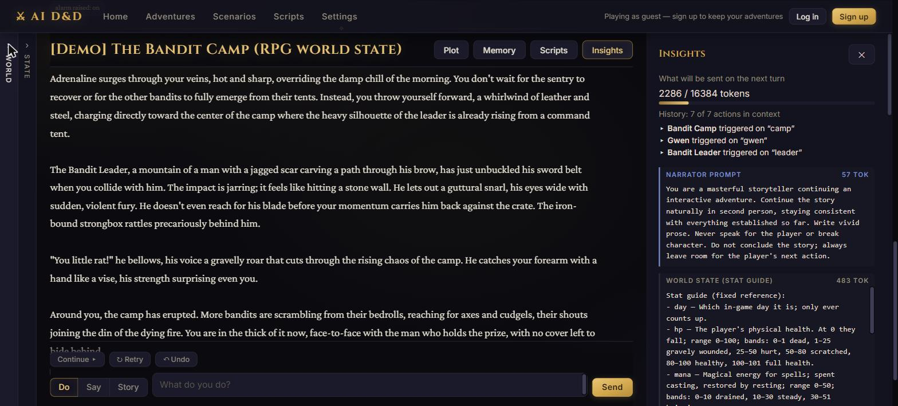
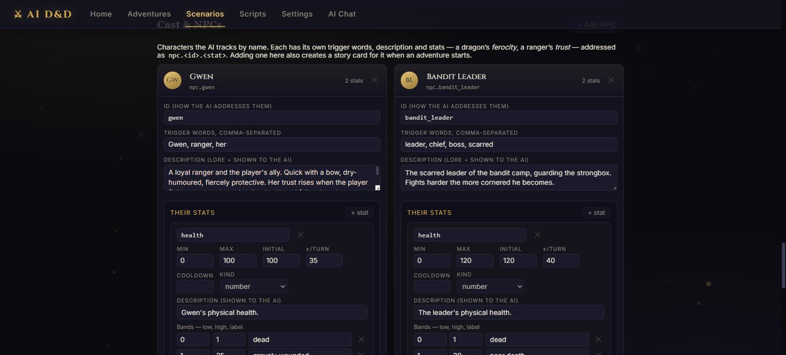
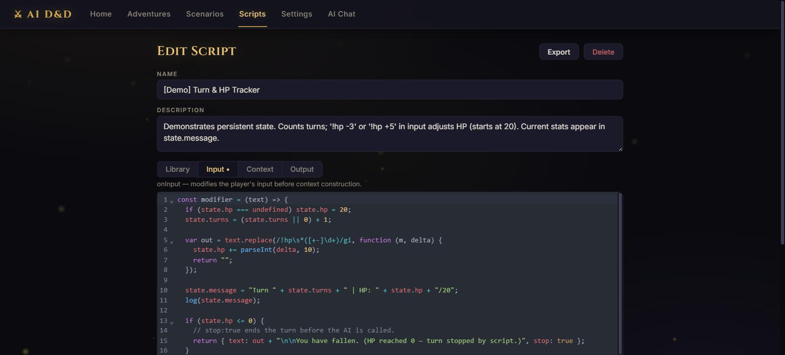
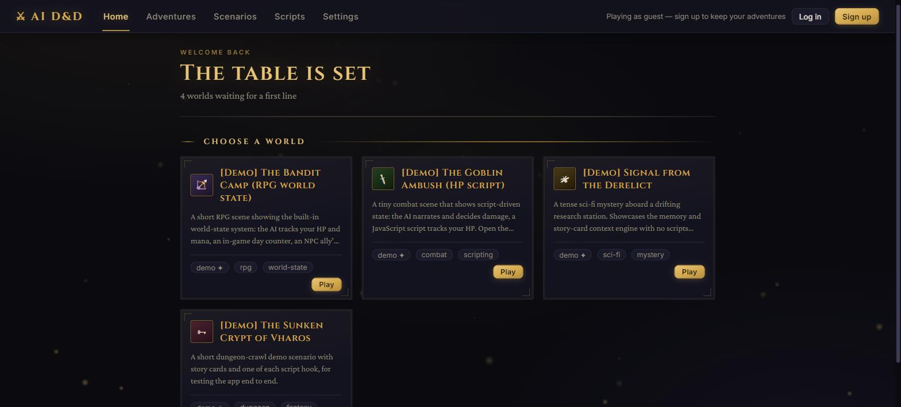
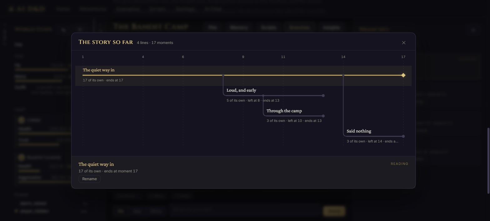
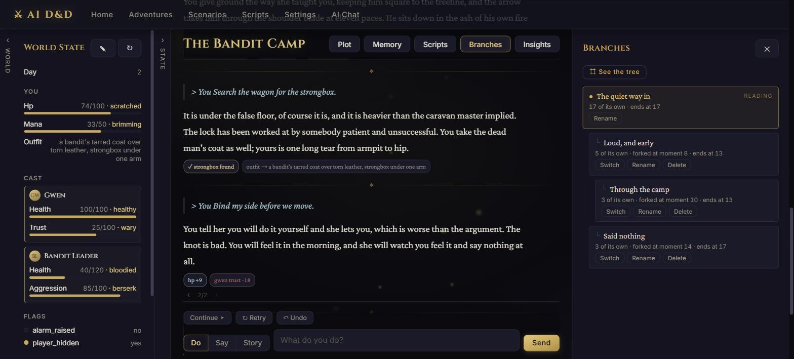

# AI D&D

[](https://github.com/parththakkar106/AI-DnD/actions/workflows/ci.yml)
[](LICENSE)

An AI Dungeon-style interactive storytelling app that runs entirely on your own machine, with
your own AI model. Create scenarios, play open-ended adventures where an LLM narrates the
world, and extend the engine with **JavaScript scripts compatible with real AI Dungeon
scripting**.

> ### ▶️ Try it live: **[parththakkar106.github.io/AI-DnD](https://parththakkar106.github.io/AI-DnD/)**
> The project page loads instantly and launches the hosted demo in one tap. Play a scenario as
> a guest: no sign-up and no API key needed. The demo runs on a free tier that sleeps, so the
> first load after it's been idle takes about 30 to 60 seconds to wake up.
>
> For the internals, read the **[design notes](https://parththakkar106.github.io/AI-DnD/guide.html)**.
> They walk through the context budgeting, the world-state referee, and the memory bank, and
> state the reasoning behind each one ([Markdown version](docs/GUIDE.md)).

Built with FastAPI and SQLAlchemy on the backend and React (Vite) on the frontend, running on
SQLite locally and Postgres in the cloud. It works with **any OpenAI-compatible endpoint**:
Ollama and LM Studio locally, or OpenRouter, OpenAI, Groq, or vLLM in the cloud. Endpoint, key,
and model are all runtime settings, and OpenRouter's free-tier models make the whole experience
cost nothing.



*The play screen. The left rail shows live world state. The AI proposes changes each turn, and
a Python engine decides what actually sticks. The chip under the narration reports what
changed. The `‹ 2/2 ›` under a turn steps between the takes it has. Writing below a take that
isn't the live one starts a new branch.*

## Features

- **The full play loop.** Do / Say / Story / Continue actions, streamed AI responses (SSE),
  retry, undo, and edit. Reasoning models are supported: "thinking" streams into a collapsible
  💭 panel with its own token budget.
- **A branching story tree.** The story is a tree, not a list. Any turn can hold more than one
  **take**, and `‹ 2/4 ›` steps between them. Stepping is free: the story below simply empties,
  and the server is told nothing. Writing below a take that isn't the live one is what makes a
  branch. Branches borrow their ancestors' turns instead of copying them, so a fork costs about
  100 bytes, and a 20-fork story loads within 1% of the same story flat. Switching restores that
  line's world state, script state, and cooldown clocks. A branch panel switches, renames, and
  deletes; **⌗ See the tree** draws every line against the story's own clock
  (`backend/app/tree.py`, `backend/app/context/lineage.py`).
- **An RPG world-state engine.** A scenario can declare stats, flags, milestones, and a named
  cast; the adventure carries their live values. The AI proposes deltas, and a Python engine
  referees them: it clamps values to range, enforces per-turn caps and cooldowns, keeps counters
  monotonic and milestones sticky, then strips the machine-readable block out of the prose
  (`backend/app/worldstate/engine.py`). Word-labeled bands (`40–60: minor damage`) make the
  model reliable at it. No dice and no scripting are required.
- **AI Dungeon-compatible context engine.** Memory, author's note, and story cards (world
  info) are triggered by keywords in recent story text, then assembled under a token budget
  (`backend/app/context/builder.py`).
- **Insights: total prompt transparency.** Every turn stores the exact prompt sent to the
  model. Open 🔍 on any AI action to see each context component, its token cost, and why it was
  included.
- **JavaScript scripting, AI Dungeon-compatible.** `onInput` / `onModelContext` / `onOutput`
  modifiers share `state` and a `worldEntries` API, and run in an embedded quickjs sandbox
  (`backend/app/scripting/`). Real AI Dungeon scripts import and run as is. An in-app CodeMirror
  editor is included.
- **Auto-summarization and Memory Bank.** The modern AI Dungeon memory system: AI-generated
  memories every few actions, a running story summary, and embedding-based retrieval that
  pulls old-but-relevant facts back into context, with similarity scores visible in Insights
  (`backend/app/memorybank.py`).
- **Undo and retry that actually roll back state.** Undo and retry roll back the world state
  and script state to a per-node snapshot, not just the text, and prune the memories that
  covered the removed turns. Nothing a retry replaces is discarded: the old attempt stays as
  another take of that turn, one keystroke and one click from becoming a branch of its own.
- **Import and export.** AI Dungeon-compatible formats for scripts and scenarios; JSON for
  everything else. An adventure exports as `ai-dnd-adventure-v2`, which carries the whole tree:
  every branch, every take, and the fork points, since those were chosen rather than computed.
  Files saved in the old single-line format still import.
- **Optional accounts for hosted deployments.** By default the app is single-user with zero
  auth friction. Set `AIDND_MULTI_USER=1` and visitors play instantly as guests (signed
  session cookie), can register (email and password) at any point to keep their data, and each
  user gets isolated data plus their own encrypted-at-rest API key. A server-funded **shared
  demo key** with a daily turn cap lets people try it without bringing a key
  (`backend/app/auth.py`). Each new guest is also given a copy of a short pre-played
  adventure, so the first screen shows real turns and their world-state changes without
  spending a demo turn (`backend/app/starter.py`).

## Screenshots

| | |
|---|---|
|  |  |
| **Insights**: the exact prompt for the next turn, broken into components with token counts and the trigger word that pulled each story card in. | **Authoring**: stats with ranges, per-turn caps, cooldowns, and word-labeled bands; NPCs the AI addresses by id. |
|  |  |
| **Scripting**: the three AI Dungeon hooks with shared persistent `state`, run in a quickjs sandbox. | **Home**: continue a story in progress or start from a scenario. |
|  |  |
| **The tree**: one lane per line, from the moment it left its parent to the moment it ends. The horizontal axis is the story's own clock, so a short branch reads as short. | **Branches**: every line the story has taken, and the three things you can do to one. A line the one you're reading was forked from can't be deleted, and says so. |

## Quick start

### Docker (any OS)

```sh
docker compose up --build
```

Open http://localhost:8000. Your data persists in a named volume across restarts.

### Windows

```powershell
cd backend; python -m venv .venv; .\.venv\Scripts\pip.exe install -r requirements.txt; cd ..
cd frontend; npm install; cd ..
.\start.ps1
```

Open http://localhost:5173 (dev servers; API docs at http://localhost:8000/docs).

### macOS / Linux

```sh
./start.sh   # creates the venv and installs dependencies on first run
```

Open http://localhost:5173.

## Connect a model

Open **Settings** in the app and point it at any OpenAI-compatible endpoint:

| Provider | Endpoint URL | Notes |
|---|---|---|
| Ollama (local) | `http://localhost:11434/v1` | free, private; also serves embedding models for the Memory Bank (e.g. `nomic-embed-text`) |
| LM Studio (local) | `http://localhost:1234/v1` | free, private |
| OpenRouter | `https://openrouter.ai/api/v1` | `:free` models cost nothing (no embeddings on the free tier) |
| OpenAI / Groq / vLLM / … | provider's `/v1` URL | anything speaking `/v1/chat/completions` |
| Claude Code CLI (local) | `http://127.0.0.1:8787/v1` | your Claude subscription instead of an API key; see [Playing against Claude locally](#playing-against-claude-locally) |

Model name, API key, generation parameters, and (optionally) summary and embedding models for
the Memory Bank are all configured there too. No config files and no rebuild are needed.

### Playing against Claude locally

`backend/tools/claude_shim.py` serves an OpenAI-compatible endpoint backed by the
`claude` command line tool, so you can play the demos against a real model without an
API key. Each request spawns one `claude --print` process, which suits the turn engine:
the app assembles the whole prompt every turn and expects a stateless endpoint.

```sh
cd backend
.venv/Scripts/python.exe tools/claude_shim.py      # listens on 127.0.0.1:8787
```

In Settings, choose the OpenAI-compatible provider, set the base URL to
`http://127.0.0.1:8787/v1`, put any non-empty string in the API key field, and pick
`sonnet`. The shim ignores the key and authenticates as you, through the CLI. Set the
reasoning budget to `0` or `-1`: a positive budget sends a `reasoning.max_tokens` field
that Claude 5 models reject.

Embeddings are not served. Leave the embedding model blank, or point the Memory Bank at
a real endpoint.

Run it against a local backend only. The endpoint has no authentication, and anything
reaching it spends your Claude quota. `app/netguard.py` blocks localhost endpoints when
`AIDND_MULTI_USER` is set, so a deployed instance cannot be pointed at it.

## How a turn works

```
player input
  → onInput script modifier
  → assemble context:  [narrator prompt] + [world state + stat guide] + [AI instructions]
                       + [plot essentials] + [story summary] + [retrieved memories]
                       + [triggered story cards] + [history along this branch, token-budgeted]
                       + [author's note] + [player action]
  → onModelContext script modifier
  → snapshot context (Insights)
  → provider adapter → AI (streamed)
  → extract + referee the world-state delta block, strip it from the prose
  → onOutput script modifier
  → store & render
```

## Architecture

```
frontend/   React + Vite SPA  ──HTTP/SSE──►  backend/  FastAPI
                                              ├─ routers/      auth, scenarios, adventures, story cards, scripts, chat, settings, analytics, debug
                                              ├─ models.py     SQLAlchemy: User, Scenario, Adventure, Branch, Action, StoryCard, Script, Settings, Memory
                                              ├─ migrations.py hand-rolled, versioned via PRAGMA user_version (64 and counting)
                                              ├─ auth.py       guest/registered users, sessions, shared demo key
                                              ├─ security.py   password hashing, cookie signing, API-key encryption
                                              ├─ tree.py       forking, promotion, and where a node is placed
                                              ├─ attempts.py   the takes of one turn, grouped by parent
                                              ├─ context/      prompt assembly under a token budget + lineage/history windowing
                                              ├─ worldstate/   the stat engine: clamps, cooldowns, bands, milestones
                                              ├─ scripting/    quickjs sandbox + AI Dungeon API surface
                                              ├─ memorybank.py auto-summarization + embedding retrieval
                                              ├─ analytics.py  buffered visit counters + the owner's dashboard query
                                              ├─ bundle.py     the export/import formats, v2 (tree) and a v1 reader
                                              ├─ providers/    OpenAI-compatible adapter, streaming
                                              └─ data.db       SQLite (path overridable via AIDND_DB_PATH)
```

In production the backend serves the built SPA from one port (see `Dockerfile`). In
development, Vite proxies `/api` to FastAPI.

## Tests

549 backend tests: unit tests plus full HTTP integration through the real quickjs scripting
engine, with the LLM provider mocked. CI runs them on every push, alongside the frontend
lint/build and a Docker image build.

```sh
cd backend && pip install -r requirements.txt -r requirements-dev.txt
python -m pytest tests/
```

## Notes on performance

Two of the tests exist because of bugs that were measured rather than guessed at. They are the
most interesting engineering in the repo.

- **Database egress, cut about 189x.** Every adventure load pulled `Action.context_snapshot`,
  the entire assembled prompt at about 74 KB per turn, to read two small fields off it. Moving
  those fields into their own columns and marking the heavy ones `deferred` took one adventure
  load from 38.5 MB to 0.20 MB. The backfill runs server-side with dialect-specific SQL, so the
  old data never crosses the wire. `tests/test_egress.py` hooks into SQLAlchemy's cursor events
  and fails if a bulk load ever names those columns again.
- **Turn cost, made flat.** Assembling a turn walked the whole story, so cost scaled with story
  length: 839 KB of reads at turn 200. `backend/app/context/history.py` now serves tails and
  slices from SQL and measures what it fetched. The same turn now costs 129 KB and stops
  growing at around turn 50.
- **Branching that costs nothing to read.** A branch stores no turns. It stores where it left
  its parent, and borrows everything above that. A 40-turn story forked twenty times loads in
  31,652 bytes against 31,433 bytes for the same story flat: a 1.007x ratio, or about 103 bytes
  per branch. Reads stay cheap because the lineage is windowed the same way the history is, so
  the number of SQL clauses is bounded by the context window rather than by the number of
  forks.

## Visit analytics

The hosted demo keeps its own analytics: an owner-only dashboard at `/analytics` shows
traffic, which shared scenarios get played, turns and demo-key spend, errors, and a funnel
from *visited* to *played a turn* to *signed up*. It is visible only to the emails listed in
`AIDND_ANALYTICS_EMAILS`, and the route returns 404 for everyone else.

This is built into the app rather than added with a third-party script, for reasons specific
to this project: the CSP allows only `script-src 'self'`, ad blockers block the popular
trackers, and none of those trackers can see the measurement that matters here, a turn. Counts
are aggregated in memory and flushed as UPSERTs, so a visit is a write and never a read, and
every dashboard query is a `GROUP BY` that returns tens of rows regardless of traffic volume.
That matters: see the egress note above for what reading rows per request costs on this stack.

## Deploy (Render)

The repo ships a [`render.yaml`](render.yaml) blueprint: one Docker web service that serves
the SPA and API same-origin, backed by external [Neon](https://neon.tech) Postgres. The free
Render tier has no persistent disk, so the database lives off-box.

1. Create a **Neon** project and copy its pooled connection string.
2. In Render, choose **New → Blueprint** and point it at this repo. Render reads
   `render.yaml`.
3. Fill in the secrets it prompts for (`sync: false` vars): `AIDND_DATABASE_URL` (the Neon
   string); `AIDND_DEMO_API_KEY` and `AIDND_DEMO_MODELS` to offer a no-signup demo; and
   `AIDND_ANALYTICS_EMAILS` (your own account's email) to see the Visitors dashboard.
   `AIDND_SECRET_KEY` is generated automatically and stays stable across deploys.
4. Deploy. Pushes to `main` auto-deploy after this. The health check is `/api/health`.

On the free tier the service sleeps after about 15 minutes idle, and the first request after
that takes about 30 to 60 seconds to wake it. Point any keep-warm pinger at `/api/health`,
which deliberately doesn't touch the database: waking the database around the clock costs far
more than the cold start saves.

## Repo notes

- `plan/` holds the phased implementation plan this project was built from, kept as a build
  log. All fourteen phases are complete. The later files (11, 12, 14) also serve as design
  notes for the state-revert, world-state, and story-tree work.
  [`plan/STATUS.md`](plan/STATUS.md) is the running thread: what shipped, what was measured,
  and what is owed next.
- [`docs/GUIDE.md`](docs/GUIDE.md) holds design notes: how each subsystem works and why it was
  built that way, with the measurements behind the decisions. It is also rendered as a
  [reading page](https://parththakkar106.github.io/AI-DnD/guide.html).
- `backend/.env.example` lists the few environment variables the backend reads.
- [`docs/self-review.md`](docs/self-review.md) records a full-codebase self-review pass and
  what came out of it. All correctness findings are resolved.

## License

[MIT](LICENSE)
